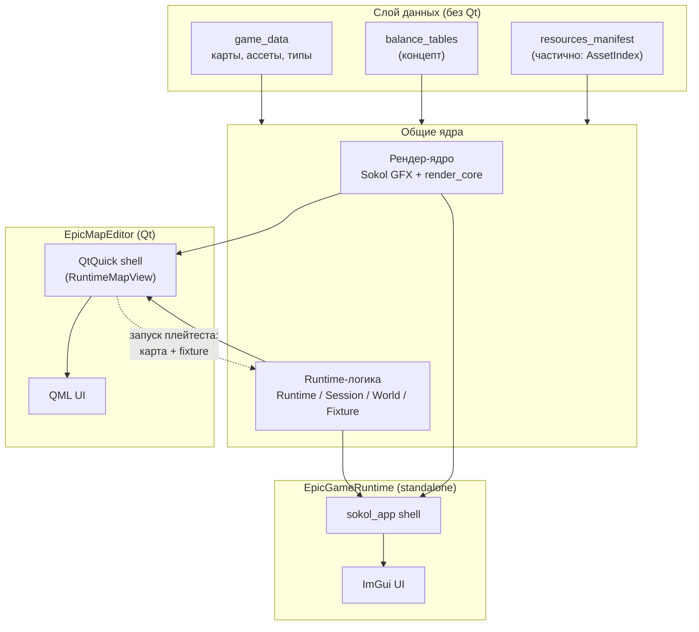

# Neverwhere

Neverwhere — это **узкоспециализированный 2D engine/suite** под system-driven игры (life-sim и narrative casual). Репозиторий содержит **редактор** и **runtime-клиент**.

- **Epic Map Editor**: редактор игровых данных и контента
- **EpicGameRuntime**: игровой клиент (runtime) для запуска/проверки результата

## Apps
- **Editor**: `src/apps/EpicMapEditor`
- **Runtime (EpicGameRuntime)**: `src/apps/EpicGameRuntime`

## High-level architecture

Проект разбит на **слои**. Нижние слои не зависят от верхних; оба приложения
(редактор и рантайм) работают с **одной и той же моделью данных** и **одним
рендер-ядром**, отличаются только UI-шеллом.

### Слои

- **Слой данных (без Qt).** Чистые структуры + JSON load/save. Должен быть
  читаем без Qt, чтобы рантайм не тянул Qt-зависимости.
- **Рендер-ядро (общее).** Sokol GFX + утилиты рендера. Одно на оба приложения.
- **Runtime-логика (общая).** Игровой мир, сессия, цикл обновления, fixtures.
  Используется и в рантайме, и при плейтесте из редактора.
- **Приложения (шеллы).** Два разных «кожуха» поверх общих слоёв:
  - **EpicMapEditor** — Qt/QML. Рендер встроен в QtQuick через
    `QQuickFramebufferObject`/`QQuickItem` + OpenGL.
  - **EpicGameRuntime** — standalone на `sokol_app`, UI на Dear ImGui.

### Что уже есть в коде, а что пока концепт

Пометки ниже относятся к именам на диаграмме:

| Блок на диаграмме | Статус | Где реально живёт |
|---|---|---|
| `game_data` | есть | `src/libs/game_data` (`assets.h`, `map.h`, `types.h`) |
| `resources_manifest` | частично | есть `AssetIndex` (загрузка индекса ассетов), но как отдельный «манифест» не выделен |
| `balance_tables` | концепт | в коде пока нет |
| `render core` (Sokol) | есть | `src/libs/graphics` + утилиты в `src/libs/render_core` (напр. `LandscapeRenderer`) |
| `editor_qt_adapters` | частично | Qt-модели-адаптеры (`QAbstractListModel` поверх EnTT) реально есть в `src/libs/core/models/`, но модуля с таким именем нет |
| `graphics_shell_qtquick` | есть (по сути) | `RuntimeMapView` (`src/apps/EpicMapEditor/src/runtime_map_view.*`) — встраивает рендер в QML |
| `graphics_shell_sokolapp` | есть (по сути) | весь `src/apps/EpicGameRuntime/main.cpp` — это шелл на `sokol_app` |
| `QML_UI` | есть | `src/apps/EpicMapEditor/qml/`, `resources.qrc` |
| `ImGui_UI` | есть | `simgui` в `EpicGameRuntime/main.cpp` |
| `game_loop` / `Runtime` | есть | `src/libs/game_runtime` (`Runtime`, `GameSession`, `GameWorld`) |
| `fixtures` | есть | `game_runtime::Fixture` (`include/game_runtime/fixture.h`) |
| `playtest_host` | частично | `RuntimeMapView` уже создаёт `Runtime` + сессию внутри редактора, но отдельного модуля «playtest host» нет |

### Схема



## Data layer (без Qt)
**Игровые данные** живут в JSON и должны быть доступны игре без Qt-зависимостей:
- **chapters** (главы) и **maps** (карты)
- **balance tables** (таблицы баланса, “excel-like” данные) в JSON
- **resources** (ассеты/пакеты ресурсов и их метаданные)

Редактор поверх этого добавляет **Qt/QML адаптеры** и инструменты редактирования, но базовые структуры и сериализация должны оставаться “чистыми”.

## Rendering
Рендер мира общий, но **разные shell/backend**:
- **Editor**: Qt/QML overlay, рендер мира встраивается в Qt (QtQuick/FBO)
- **Runtime**: standalone shell (сейчас `sokol_app`) + игровой UI на **Dear ImGui**

## Play-Test в редакторе (концепт)
Редактор должен уметь **запускать EpicGameRuntime на текущей редактируемой карте**.

Если runtime-логике нужны данные, которых нет в карте (профиль игрока, прогресс, инвентарь, сейвы), редактор предоставляет их через **fixture-подобные провайдеры** (по аналогии с unit tests):\n- фиксированный “профиль по умолчанию”\n- тестовый инвентарь/прогресс\n- временное хранилище (in-memory) на время сессии плейтеста
Если runtime-логике нужны данные, которых нет в карте (профиль игрока, прогресс, инвентарь, сейвы), редактор предоставляет их через **fixture-подобные провайдеры** (по аналогии с unit tests):
- фиксированный “профиль по умолчанию”
- тестовый инвентарь/прогресс
- временное хранилище (in-memory) на время сессии плейтеста

## Build (Windows, CMake + vcpkg)
Сборка использует vcpkg (подключён как submodule). Мы **не патчим** `toolchain/vcpkg` напрямую.

Основной Windows-flow строится вокруг CMake Presets и Visual Studio 2022:

```bat
generate_vs.bat
```

По умолчанию скрипт bootstrap'ит vcpkg при необходимости и генерирует solution через preset `vs2022`. После этого можно открыть:

```text
_intermediate_64\Neverwhere.sln
```

Можно явно выбрать CMake configure preset:

```bat
generate_vs.bat vs2022
```

Сборка после генерации выполняется из Visual Studio или явно через CMake/MSBuild:

```bat
cmake --build --preset debug --target EpicMapEditor
```

Sokol подключён через **overlay port**, чтобы держать `util/sokol_imgui.h` совместимым с актуальным Dear ImGui из vcpkg:
- `vcpkg_overlays/ports`
- путь уже подключён в `CMakePresets.json` через `VCPKG_OVERLAY_PORTS`

## Roadmap (кратко)
- **Undo/Redo**: перейти на неизменяемые снэпшоты через `immer` (см. `docs/TECHNICAL_STACK.md`)
- **Data/View separation**: отделить данные от QObject/QML представлений
