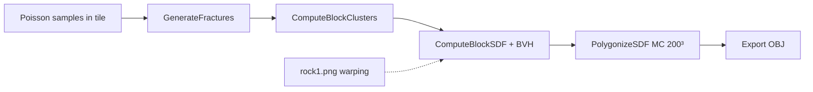

# Rock-fracturing: upstream vs CliffsGenerationPlayground

Анализ [aparis69/Rock-fracturing](https://github.com/aparis69/Rock-fracturing) (commit `b91965b`, 2022-05-20) относительно нашего порта в `CliffsGenerationPlayground`.

Автор upstream явно предупреждает: это **переписанный** research-код, не бинарно идентичный сценам из статьи; часть операторов из paper в репозитории **отсутствует даже в оригинале**.

---

## 1. Что делает upstream

Консольное приложение без viewer: при запуске генерирует **4 OBJ-файла** (по одному на тип трещин), их можно открыть в Blender/MeshLab.

Фиксированные параметры в `Code/Source/main.cpp`:

| Параметр | Значение upstream |
|----------|-------------------|
| `tileSize` | 20 |
| Poisson radius / tries | 0.5 / 10000 |
| `GenerateFractures(..., r)` | `r = 3` (**не используется** внутри функции) |
| MC grid | **200 × 200 × 200** (hardcoded) |
| OpenMP | да, 16 потоков на field |
| Seed | `srand(1234)` |
| Warping | `../Textures/rock1.png` |
| Smoothing radius блоков | **0.25** (hardcoded в `ComputeBlockSDF`) |
| BVH transition `re` | **0.5** (hardcoded) |

Артефакты в репозитории:

- `Objs/tile_*.obj` — prebuilt меши (~30–90 MB каждый)
- `Textures/rock1.png`, `rock2.png`
- VS2017 / VS2019 / VS2022 / G++ Makefile

---

## 2. Карта файлов

| Upstream | Neverwhere | Статус |
|----------|------------|--------|
| `Code/Include/basics.h` | `rock_fracture/Basics.h` | Порт, namespace `rock_fracture` |
| `Code/Include/vec.h` | `rock_fracture/Vec.h` | Порт |
| `Code/Include/noise.h` | `rock_fracture/Noise.h` | Порт |
| `Code/Include/MC.h` | `rock_fracture/MC.h` | Порт (MarchingCubeCpp) |
| `Code/Include/convhull_3d.h` | `rock_fracture/Convhull3d.h` | Порт |
| `Code/Include/blocks.h` | `rock_fracture/Blocks.h` | Порт + `GenerateProceduralWarpingField`, MC с `resolution` |
| `Code/Source/blocks.cpp` | `rock_fracture/Blocks.cpp` | Порт + OpenMP optional, configurable MC |
| `Code/Source/blocks-sdf.cpp` | `rock_fracture/BlocksSdf.cpp` | Сохранён под `#if 0` (альтернативный BVH union box) |
| `Code/Source/main.cpp` | `RockFractureScene.cpp` + `main.cpp` | Pipeline в scene; UI/viewer отдельно |
| `Textures/rock1.png` | `resources/textures/rock1.png` | Есть |
| `Textures/rock2.png` | — | **Нет** |
| `Objs/*.obj` | — | **Нет** (можно скачать из upstream для регрессии) |
| — | `RockFractureRenderer.*` | **Только у нас** — CPU preview |
| — | `RenderTypes.h` | **Только у нас** |

---

## 3. Алгоритмический core — что совпадает

Следующие этапы **портированы и вызываются** в `RockFractureScene::rebuild()`:

1. **PoissonSamplingBox** — dart-throwing в `Box(center, halfTile)`.
2. **GenerateFractures** — 4 типа: Equidimensional, Rhombohedral, Polyhedral, Tabular (логика совпадает с upstream).
3. **ComputeBlockClusters** — constrained nearest-neighbor graph + flood fill, `R_Neighborhood = 2.5²`, `R_Max_Block = 10.5²`, min cluster size > 10.
4. **ComputeBlockSDF** — convex hull → planes → `SDFBlock` → `SDFGradientWarp` → `SDFUnionSphereLOD::OptimizedBVH`.
5. **PolygonizeSDF** — marching cubes по полю SDF в bounding box корня BVH.
6. **Gradient warping** — triplanar sampling greyscale поля, strength 0.65, texScale 0.1642.

Зависимости совпадают с upstream: convhull_3d, MC, stb_image (у нас — vcpkg `stb`).

---

## 4. Что есть у нас, чего нет в upstream

| Возможность | Комментарий |
|-------------|-------------|
| **Интерактивный viewer** | Sokol + ImGui, orbit-камера, pan/zoom, world grid по AABB меша |
| **Debug-панель (top view)** | Samples, fractures, cluster centers в 2D (XZ) |
| **Async rebuild** | Worker thread + `withModel()` mutex |
| **Настраиваемые параметры UI** | tile size, Poisson, MC resolution 40–200, seed, OpenMP toggle, warping toggle |
| **Procedural warping fallback** | `GenerateProceduralWarpingField` (Perlin fBm) если `rock1.png` не найден |
| **CPU shading preview** | ambient / diffuse / specular / rim / fog (не из paper) |
| **Field range scan** | `fieldMin` / `fieldMax` для stats |
| **Интеграция в monorepo** | CMake `nw_add_console_app`, vcpkg, OpenMP через preset |

---

## 5. Что есть в upstream, чего нет у нас

| Возможность | Приоритет для переноса | Комментарий |
|-------------|------------------------|-------------|
| **Batch export 4 OBJ** | Высокий | Upstream `main` пишет `tile_equidimensional.obj` … `tile_tabular.obj`. У нас нет export — только on-screen preview. |
| **Prebuilt reference meshes** | Средний | `Objs/` — эталон для visual/regression diff без MC 200³ (~минуты ожидания). |
| **MC resolution = 200 по умолчанию** | Средний | У нас default **100** → меньше детализация, быстрее preview. Для parity с upstream — preset «Paper quality». |
| **rock2.png** | Низкий | В upstream есть, в `main` не используется; только rock1. |
| **blocks-sdf.cpp variant** | Низкий | Union BVH **без** `Extended(re)` на box; лежит у нас в `BlocksSdf.cpp` (`#if 0`). |
| **Standalone VS/G++ projects** | — | Заменено CMake Neverwhere |
| **ComputeBlockMeshes** | — | Упоминается в комментарии upstream к `ComputeBlockSDF`, но **в публичном репо не реализовано** |

---

## 6. Что описано в paper / README upstream, но нигде не реализовано

Из README upstream (секция *Missing*):

| Фича paper | Upstream | Neverwhere |
|------------|----------|------------|
| Implicit replication operator | нет | нет |
| Periodic tiling | нет | нет |
| Aperiodic tiling | нет | нет |
| Некоторые result scenes из статьи | нет | нет |

Это **не gap нашего порта** — это ограничение самого open-source release.

---

## 7. Расхождения и «ложные» UI-контролы

Параметры, которые **есть в UI**, но **не влияют** на `rock_fracture` (или не так, как ожидает пользователь):

| UI control | Ожидание | Факт |
|------------|----------|------|
| **Fracture inflate** | радиус/раздувание трещин | передаётся в `GenerateFractures`, но там `(void)r` — **no-op** (как и в upstream) |
| **Smoothing radius** | `SDFBlock` smooth | hardcoded **0.25** в `Blocks.cpp::ComputeBlockSDF` |
| **BVH transition** | аргумент `OptimizedBVH(..., re)` | hardcoded **0.5** |

Debug top view использует фиксированный `halfTile = 10` — при изменении **Tile size** сетка debug не масштабируется (mesh view — корректно).

---

## 8. Отличия реализации (не функциональные пробелы)

| Тема | Upstream | Neverwhere |
|------|----------|------------|
| Clustering queue | `std::queue` | `std::vector` as stack (тот же BFS, другой порядок обхода) |
| BVH union box | `Box(a,b).Extended(re)` в `blocks.cpp` | То же (активная версия) |
| MC memory | `delete[] field` — в upstream **утечка** (нет delete в snippet) | `delete[] field` после MC |
| Namespace | global | `rock_fracture::` |
| stb | bundled header | vcpkg |

---

## 9. Рекомендуемый backlog (по убыванию пользы)

1. **Export OBJ/GLTF** из playground (parity с upstream workflow + pipeline в DCC).
2. **Preset «Upstream defaults»**: MC=200, tile=20, poisson 0.5/10000, seed 1234.
3. **Провести `blockSmoothingRadius` / `bvhTransitionRadius` в `ComputeBlockSDF`** (или убрать слайдеры).
4. **Регрессия против `Objs/tile_equidimensional.obj`** (Hausdorff / vertex count / bbox) на фиксированном seed.
5. **Реализовать или удалить «Fracture inflate»** — сейчас вводит в заблуждение.
6. **GPU mesh path** (sokol-gfx) вместо ImGui CPU tri fill — performance, не algorithm gap.
7. **Paper-only**: replication + tiling — отдельный R&D track, upstream не поможет.

---

## 10. Краткий вердикт

| Слой | Покрытие |
|------|----------|
| Core pipeline (samples → fractures → clusters → SDF → MC) | **~100%** публичного upstream |
| Paper-complete система | **~частично** (как и upstream) |
| Tooling / viewer / editor integration | **у нас больше**, чем в upstream |
| Export + reference assets | **у upstream больше** |
| Параметрическая честность UI | **есть дыры** (слайдеры без эффекта) |

Наш playground — это **интерактивная оболочка** вокруг того же research pipeline, с preview и эксперiment UI, но без batch OBJ export и без prebuilt эталонов. Для «как в статье по качеству меша» нужно поднять MC до 200 и сравнить с `Objs/`; для «как в paper по сценам» ни upstream, ни мы не покрываем replication/tiling.
