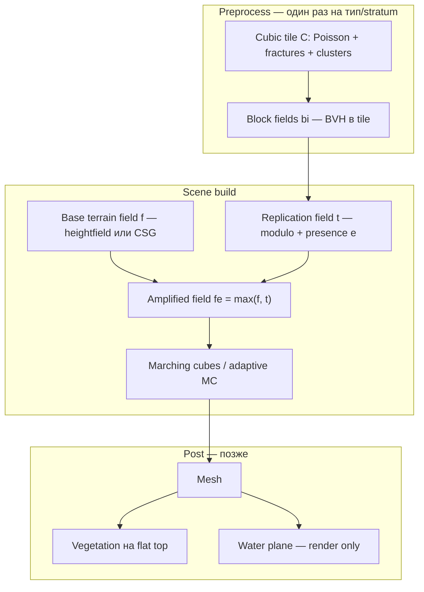

# Roadmap: от cubic tile к сценам как в paper (Fig. 11–14)

Цель — получать **объёмные скалы с арками, плато и «стенами» блоков**, как на иллюстрациях Paris et al. (TVC 2020), **без текстур на первом этапе** (только геометрия + простой shading).

Картинка с тремя вариантами (tabular / equidimensional / rhombohedral на одной форме скалы) — это **Figure 14** из статьи: один и тот же macro-terrain, разные **типы fracture / strata**, не три разных алгоритма.

---

## 1. Что у нас уже есть (и чего это не даёт)

| Слой | Сейчас (`rock_fracture` + playground) | Что на картинке paper |
|------|----------------------------------------|------------------------|
| **Micro** | Gradient warping внутри одного блока | То же |
| **Meso** | Fractured blocks в **одном** кубе `C` (tileSize ≈ 20 m) | Блоки **размножены** по вертикальным стенам скалы |
| **Macro** | Нет | Остров/мост с **аркой**, плато, вода, ~50–150 m |
| **Композиция** | MC только по BVH одного тайла | `fe = max(f, t)` — terrain + replication |
| **Страты** | 4 типа трещин на весь тайл | Разные типы блоков **по высоте/материалу** (Fig. 11) |
| **Деревья / вода** | Нет | Flat top без блоков + instancing (не часть SDF камня) |

**Вывод:** core **генерации блока** у нас совпадает с open-source upstream; **сцену как у автора** даёт второй половины paper — **terrain amplification + selective replication**, которой **нет в GitHub** и которую нужно проектировать и писать самим, опираясь на статью (§5–5.1).

---

## 2. Целевой pipeline (как в paper)



### Ключевые формулы (§5, preprint)

**Replication** (упрощённо):

```
t(p) = max_i  bi(p mod s) · ei(ai + s · ⌊p/s⌋)
```

- `s` — размер cubic tile (напр. 20 m).
- `bi` — signed field блока из нашего `ComputeBlockSDF` (уже есть).
- `ei` — presence: реplicировать блок только если anchor удовлетворяет критериям.

**Amplified terrain:**

```
fe(p) = max(f(p), t(p))
```

**Base terrain из heightmap** (частый случай в paper):

```
f(p) = p.z − h(p.x, p.y)
```

**Presence (минимальный набор для «как на картинке»):**

| Критерий | Зачем |
|----------|--------|
| `\|∇f · uz\| < ε` | Блоки **только на steep/vertical** стенах, не на плато (там деревья) |
| `f(ak) ∈ [va, vb]` | Дистанция anchor до поверхности — блок «на стене», не в воздухе |
| `γ(ak) == material(Bi)` | **Strata:** tabular сверху, equidimensional снизу (Fig. 11, 14) |
| У соседних cells | Если `p` близко к границе tile — union из 2/4/8 соседних клеток (без швов) |

---

## 3. Два пути развития

### Путь A — **Paper-faithful** (рекомендуется для Neverwhere)

Строим `fe` как в статье, переиспользуем `rock_fracture` как **библиотеку тайлов**.

| Плюсы | Минусы |
|-------|--------|
| Геология и стили блоков как у автора | Replication + presence — **R&D с нуля** |
| Арки/overhangs из `f`, не из heightmap | MC по большому bbox дорогой |
| Масштаб 50–150 m из Table 2 paper | Нужен adaptive MC или sparse field |

### Путь B — **Hybrid MVP** (быстрый визуальный прототип)

1. Macro-mesh: CSG (box − arch cylinder) или heightfield + boolean.
2. Деталь: наш tile MC **только в shell** вокруг поверхности (offset sampling), без полного `fe`.
3. Стиль: менять fracture kind / warping.

| Плюсы | Минусы |
|-------|--------|
| Первый «остров с аркой» за 1–2 спринта | Не paper-correct, швы на стыках |
| Меньше MC voxels | Strata и replication — имитация |

**Рекомендация:** параллельно — **B для demo**, **A для продукта**; общий `SceneSpec` и viewer.

---

## 4. Фазы реализации

### Phase 0 — Foundation (1 sprint)

**Цель:** честная база под сцены, без новой математики.

- [ ] Preset **«Paper tile quality»**: MC=200, seed=1234, poisson 0.5/10000.
- [ ] Export **OBJ** из playground (upstream workflow).
- [ ] Провести в код `blockSmoothingRadius`, `bvhTransitionRadius` (или убрать слайдеры).
- [ ] **`TileLibrary`**: один раз генерировать `SDFNode*` / cache field для каждого `FractureType` + seed stratum.

**DoD:** один тайл экспортируется и визуально близок к `Objs/tile_*.obj`.

---

### Phase 1 — Macro terrain `f` (1–2 sprints)

**Цель:** форма острова/каньона **с аркой**, flat top, без блоковой детали.

Новый модуль (предлагаемое имя): `rock_scene/TerrainField.h`

| Примитив | Назначение |
|----------|------------|
| `HeightfieldTerrain` | `f(p) = p.z − h(x,y)` — плато + обрыв |
| `CSGSubtract` | Арка: `max(f_rock, −f_tunnel)` |
| `CSGIntersect` | Ограничение bbox сцены |
| `SeaLevelClip` | Обрезка ниже water (опционально) |

**Authoring:** `SceneSpec` JSON/struct:

```cpp
struct SceneSpec {
    float sceneSizeX = 100.f;  // paper Sea cliff: 100 m
    float sceneSizeY = 40.f;
    float plateauHeight = 12.f;
    ArchSpec arch;             // center, radius, axis
    // ...
};
```

**DoD:** MC только по `f` → mesh с аркой и ровным верхом; viewer показывает macro без fracture noise.

---

### Phase 2 — Naive replication (2–3 sprints)

**Цель:** «стена из блоков» на vertical face **без** полного presence.

- [ ] `ReplicationField::evaluate(p)` — grid `N×M×K` явных копий tile field (шаг `s`).
- [ ] `fe = max(f, t)` на coarse grid → MC.
- [ ] UI: размер сцены, число повторов tile, fracture kind.

**DoD:** длинная vertical cliff с видимой blocky структурой; плато остаётся гладким если `t` обнулять при `|∇f·up| > ε` (простой presence v1).

---

### Phase 3 — Selective replication (paper §5) (3–5 sprints)

**Цель:** поведение как Fig. 11 / 14.

- [ ] Anchor grid + `p mod s` + соседние cells у границ.
- [ ] Presence `e`: slope, distance band `[va,vb]`, material `γ`.
- [ ] **Strata editor:** зоны по Y (или по implicit γ): нижний stratum = Equidimensional, верхний = Tabular.
- [ ] Несколько precomputed tiles (`TileLibrary`) — переключение `bi` по stratum.

**DoD:** одна macro-форма, три preset strata → три стиля как на Fig. 14.

---

### Phase 4 — Performance (ongoing)

| Technique | Когда |
|-----------|--------|
| Sparse / narrow-band MC вокруг `fe ≈ 0` | bbox > 40 m |
| Chunked async MC + stitch | interactive editor |
| GPU field eval (compute shader) | после CPU proof |
| Dual contouring / MC 200 только у cliff | quality pass |

Paper: Sea cliff 100×100 m, ~959 replicated blocks, **< 1 MB** на хранение `bi` — узкое место у нас **sampling + MC**, не память BVH.

---

### Phase 5 — Authoring (editor-facing)

- Prescribed blocks (Fig. 6): user-placed implicit primitives в tile → override clusters.
- Construction tree для `f` (как [18] Peytavie) — опционально, если нужны сложные арки.
- Integration с `landscape_mesh` / Epic Map Editor: cliff mask с карты → presence `e`.

---

### Phase 6 — Вне геометрии камня (отдельно)

| Элемент | Подход |
|---------|--------|
| **Деревья** | Placement на `∇fe ≈ up` && `fe ≈ 0` && `y > threshold`; instancing, не SDF |
| **Вода** | Плоскость + depth в renderer |
| **Текстуры** | Triplanar / gradient warping уже задаёт micro-relief; albedo позже |

---

## 5. Предлагаемая структура кода

```
src/apps/CliffsGenerationPlayground/
  rock_fracture/          # без изменений контракта: tile C → SDFNode* / mcMesh
  rock_scene/             # NEW
    SceneSpec.h           # macro + strata + water
    TerrainField.h        # f(p)
    TileLibrary.h         # cache bi per FractureType/stratum
    ReplicationField.h    # t(p), presence e
    SceneComposer.h       # fe = max(f,t), bbox, MC orchestration
  RockFractureScene.*     # → CliffScene: preprocess tiles + compose fe
  RockFractureRenderer.*  # macro bbox grid, optional water plane
```

**Интерфейс генерации (целевой):**

```cpp
// High-level API for editor/runtime later
CliffSceneModel buildCliffScene(const SceneSpec& spec, const TileLibrary& tiles);
```

`RockFractureScene::rebuild` остаётся режимом **«Single tile debug»**; новый режим **«Full scene»**.

---

## 6. Связь с другим кодом Neverwhere

| Компонент | Роль |
|-----------|------|
| **`CliffsGenerationPlayground`** | Paper blocks + replication R&D |
| **`MeshGenerationPlayground`** | FastNoise cliff — **silhouette / strata preview**, не замена `bi` |
| **`landscape_mesh`** | Heightfields карты → будущий input `h(x,y)` для `f` |
| **`render_core`** | Позже GPU mesh path вместо ImGui CPU fill |

Не смешивать FastNoise displacement с `bi`: на Fig. 12 paper показывает, что «просто шум» не даёт geologically consistent blocks.

---

## 7. Риски и mitigations

| Риск | Mitigation |
|------|------------|
| MC 200³ на 100 m scene — нереально dense | MC только в band вокруг surface; multi-res |
| Долгая interactive rebuild | Async chunks; preview MC 64 + refine |
| Replication без reference C++ | Unit tests: `t(p mod s)` периодичность; slope mask на synthetic plane |
| Отличие от картинок paper | Ожидаемо (автор сам говорит: open-source ≠ paper scenes) — сравнивать **структуру**, не pixel match |

---

## 8. Минимальный MVP «как на картинке без текстур»

Самый короткий путь к **узнаваемому** результату:

1. **Phase 1** — CSG island + arch + flat top (`f` only).
2. **Phase 2** — один Equidimensional tile, replication 5×3×2 на vertical faces, `fe = max(f,t)`.
3. UI preset **«Fig. 14 — equidimensional / tabular / rhombohedral»** = смена `TileLibrary` + stratum split по Y.
4. Flat top: `ei = 0` где `normal · up > 0.7`.
5. Простой зелёный instancing «ёлок» на плато (placeholder cubes).

Оценка: **~4–6 недель** part-time R&D после Phase 0.

---

## 9. Что сознательно не делаем в v1

- Periodic / Wang aperiodic tiling (§4.1) — после basic replication.
- Implicit replication operator «как в [23]» в полной общности — достаточно selective `max(bi · ei)`.
- Vue/streaming pipeline из paper — у нас Sokol/ImGui/editor stack.
- Полная compat с [18] construction trees — Phase 5+.

---

## 10. Ссылки

- [Paris2020_Modeling_Rocky_Scenery_Implicit_Blocks.pdf](./Paris2020_Modeling_Rocky_Scenery_Implicit_Blocks.pdf) — preprint (локально в репо).
- [rock-fracturing-upstream.md](./rock-fracturing-upstream.md) — что уже портировано из GitHub.
- Paper §3–5 — overview, fracturing, amplification.
- Fig. 11 — strata (equidimensional bottom + tabular top).
- Fig. 13 — arches: layer-stack vs blocks on vertical walls.
- Fig. 14 — **целевой visual**: три стиля блоков на sea cliff.
